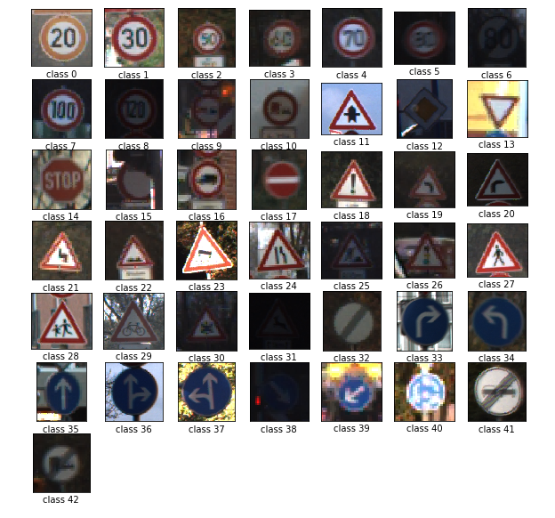

# Traffic signs classification with a convolutional network

In this project, I used a convolutional neural network (CNN) to classify traffic signs. The German Traffic Sign dataset consists of 43 different traffic sign with each image having 32×32 px size. This dataset has 39,209 images as training data and 12,630 images as a test data. Each image is a photo of one of the 43 class of traffic sign. The dataset is public and you can download it using [data_Downloader](https://github.com/maurehur/data_downloader.git) repository.

